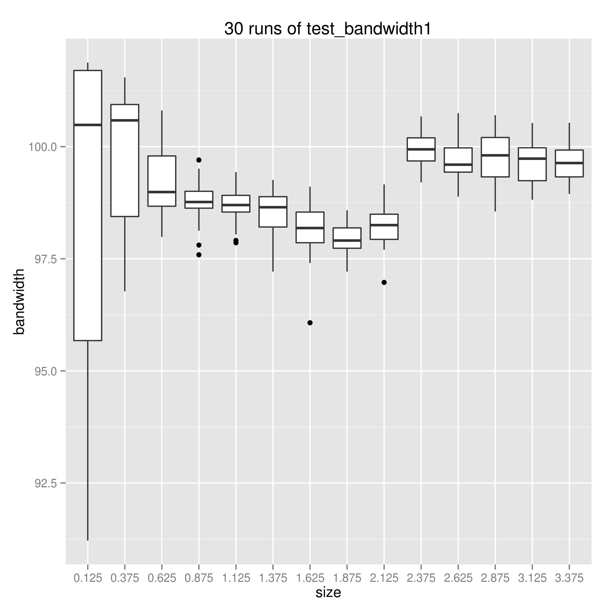
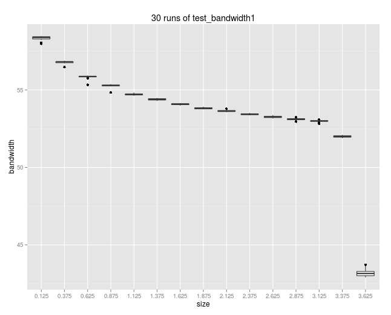

```

The make run run both executive program (*1.out *2.out)
Here run 1.out only but 30 times to generate the tsv files 

bash>

rm test_bandwidth1_GTX950.stdout

for s in {1..30}; do ../test_bandwidth1.out >> test_bandwidth1_GTX950.stdout; sleep 1; done

grep ^Data test_bandwidth1_GTX950.stdout \
 | perl -plne's/.*?([\d\.]+).*?Bandwidth:\ ([\d\.]+).*/$1\t $2/;' > bandwidth1_GTX950.tsv

# due to mac have to copy results out to ~

cd ..
cp -f results/* ~/results
cd ~/results
R


R>
getwd()
// if necessary setwd("")

library(ggplot2)
df = read.delim("bandwidth1_GTX950.tsv", col.names=c("size", "bandwidth"))
df$size = as.factor(df$size)
ggplot(df, aes(size, bandwidth)) + geom_boxplot() + ggtitle("30 runs of test_bandwidth1_GTX950")

ggsave("test_bandwidth1_GTX950.png")
```

### GTX Titan



### GTX970 arch=compute_50,code=sm_50



